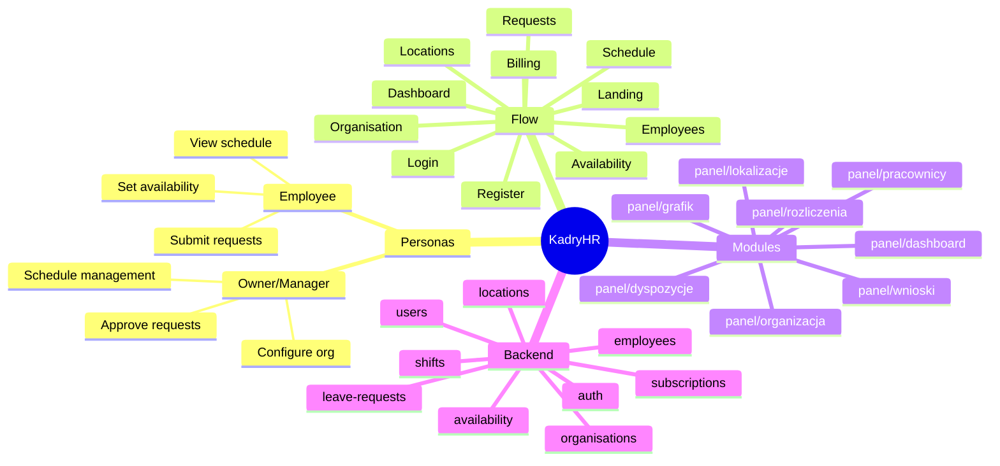

# KadryHR – Product Feature Map

## Overview

KadryHR is a workforce management / HR SaaS platform designed for **retail, shift-based teams, and small-to-medium businesses** in Poland. It aims to compete with established solutions like **Kadromierz.pl** and **GIR Staff** by providing:

- **Employee scheduling (Grafik)** — visual weekly schedule with drag-and-drop shift assignment
- **Leave request management (Wnioski)** — workflow for paid leave, sick days, and other absences
- **Availability collection (Dyspozycje)** — employees submit their available time windows
- **Team & employee management (Pracownicy)** — CRUD operations for employee records
- **Multi-location support (Lokalizacje)** — manage multiple stores/branches
- **Organisation settings (Organizacja)** — branding, delivery days, promotion cycles

The platform is built with:
- **Frontend:** Next.js 14+ (App Router), TypeScript, Tailwind CSS
- **Backend:** NestJS, Prisma ORM, PostgreSQL
- **Authentication:** JWT-based with refresh tokens

---

## Personas

### Owner / Manager
- **Goals:**
  - Create and manage weekly/monthly schedules
  - Approve or reject leave requests from employees
  - Monitor team availability and capacity
  - Add/edit/deactivate employees
  - Configure organisation settings (locations, branding)
  - Track hours worked (future: payroll integration)
- **Primary screens:** Dashboard, Grafik, Pracownicy, Wnioski, Dyspozycje (team view), Organizacja, Lokalizacje

### Employee
- **Goals:**
  - View their own schedule
  - Submit leave requests (urlopy, chorobowe)
  - Provide availability/preferences for scheduling
  - Receive notifications about schedule changes
- **Primary screens:** Dashboard (limited), Grafik (own shifts), Wnioski (own requests), Dyspozycje (own availability)

---

## Customer Journey (Conceptual)

1. **Landing Page (`/`)** — Marketing site explaining value proposition
2. **Registration (`/register`)** — Self-service sign-up creates organisation + owner account
3. **Login (`/login`)** — Email/password authentication
4. **Dashboard (`/panel/dashboard`)** — Overview of today's schedule, team stats, pending requests
5. **Organisation Setup (`/panel/organizacja`)** — Configure company name, logo, industry category
6. **Locations (`/panel/lokalizacje`)** — Create store/branch locations
7. **Employees (`/panel/pracownicy`)** — Add team members, assign to locations
8. **Availability (`/panel/dyspozycje`)** — Collect employee availability windows
9. **Schedule (`/panel/grafik`)** — Build weekly shift schedule, assign employees
10. **Requests (`/panel/wnioski`)** — Handle leave requests (approve/reject)
11. **Billing (`/panel/rozliczenia`)** — View subscription status (payments not yet active)
12. **Time Tracking / Payroll** — *Not yet implemented in UI*

---

## Modules and Screens

### Landing Page (`/`)

**Purpose:**
Marketing/landing page for new visitors to understand the product offering.

**Current Implementation:**
- Hero section with value proposition
- Problem/Solution section
- Product tour / feature highlights
- Use cases (retail, shift teams)
- Social proof / testimonials placeholder
- Pricing section (basic pricing tiers)
- Contact section
- Security section

**Components used:**
- `MarketingHeader`, `Hero`, `ProblemSolution`, `ProductTour`, `StorySection`, `FeatureGroups`, `UseCases`, `SocialProof`, `PricingSection`, `SecuritySection`, `ContactSection`, `LandingFooter`

**What's working:**
- Polished, animated landing page with dark theme
- Clear CTAs pointing to `/login` and `/register`
- SEO schema markup present

**Gaps/Missing:**
- No working contact form (placeholder only)
- Demo booking link not functional
- No blog or knowledge base

---

### Login (`/login`)

**Purpose:**
Authenticate existing users.

**Current Implementation:**
- Email + password form
- Error handling for invalid credentials, network issues
- Redirect to `/panel/dashboard` on success
- Links to `/register` and home page

**What's working:**
- Clean, polished UI with branding
- Suspense boundary for query params
- Redirects with `?redirect=` query param support

**Gaps/Missing:**
- No "Forgot password" functionality (link exists but no page)
- No OAuth/social login
- No 2FA prompt (backend supports it but not in UI)

---

### Register (`/register`)

**Purpose:**
Self-service registration for new organisations.

**Current Implementation:**
- Form fields: organisation name, first name, last name, email, password, confirm password
- Creates new organisation + owner user in one step
- Redirects to dashboard on success

**What's working:**
- Full self-service registration flow
- Password validation (minimum 8 characters)
- Toast notification on success

**Gaps/Missing:**
- No email verification step
- No terms of service / privacy policy checkbox
- No CAPTCHA or bot protection

---

### Dashboard (`/panel/dashboard`)

**Purpose:**
Overview of organisation activity for the current week.

**Current Implementation:**
- Header showing current week range
- "Today's schedule" card with shift cards
- "Employees & Roles" card with tabs (All, Active, On leave, Pending)
- "Work time statistics" chart showing hours per day
- "Analytics" quick stats (on leave today, scheduled today)
- "Requests" card showing recent pending leave requests

**Data loaded:**
- Shifts for current week (`apiGetShifts`)
- Employees list (`apiListEmployees`)
- Pending requests (`apiGetRequests`)
- Approved leaves for schedule (`apiGetApprovedLeavesForSchedule`)

**What's working:**
- Real-time data from backend
- Visual chart of planned hours
- Quick access to pending requests

**Gaps/Missing:**
- "Akceptuj" and "Odrzuć" buttons on requests link to `/panel/wnioski` instead of inline action
- No real analytics (hours worked vs planned, labor cost, etc.)
- No alerts for understaffing or schedule conflicts
- Employee view is limited (should show "my shifts today")

---

### Grafik / Schedule (`/panel/grafik`)

**Purpose:**
Weekly schedule view and shift management for managers.

**Current Implementation:**
- Weekly grid view (Mon-Sun columns, employees as rows)
- Week navigation (prev/next/today)
- Location filter dropdown
- Shift creation modal with employee, location, time, position, notes, color
- Drag-and-drop shift reassignment
- Availability indicators per employee per day
- Approved leave overlay (shows when employee is on leave)
- Schedule templates (save current week, apply template)
- Copy previous week functionality
- Clear week functionality
- Publish schedule (notify employees)
- Shift presets (quick buttons for common shift times)
- Availability override warnings (assign outside availability with reason)

**Backend endpoints used:**
- `GET /shifts` — list shifts for date range
- `POST /shifts` — create shift
- `PATCH /shifts/:id` — update shift
- `DELETE /shifts/:id` — delete shift
- `POST /shifts/publish-schedule` — notify employees
- `POST /shifts/clear-week` — delete all shifts in range
- `POST /shifts/copy-previous-week` — get payloads from previous week
- `GET /availability` — employee availability
- `GET /shifts/schedule-metadata` — delivery days, promotion days
- `GET /schedule-templates` — list templates
- `POST /schedule-templates/from-week` — create template from current week
- `GET /schedule-templates/:id` — get template detail
- `GET /shift-presets` — list shift presets
- `GET /leave-requests/approved-for-schedule` — approved leaves in range

**What's working:**
- Full CRUD for shifts
- Drag-and-drop reassignment
- Template system
- Copy previous week
- Availability checking and override
- Location filtering
- Shift colors
- Delivery day and promotion day indicators

**Gaps/Missing:**
- No monthly view
- No employee self-view (employees see full grid, should see only their shifts)
- No conflict detection (overlapping shifts)
- No automatic scheduling suggestions
- No export to PDF/Excel
- No print view
- Limited mobile experience

---

### Pracownicy / Employees (`/panel/pracownicy`)

**Purpose:**
Manage employee records.

**Current Implementation:**
- Card grid view of employees
- Status filter tabs (Active, Inactive, All)
- Employee card shows: avatar, name, email, phone, position, locations, status badges
- "Dodaj pracownika" button opens modal
- Employee form: first name, last name, email, phone, position, location assignment
- Avatar upload (for existing employees)
- Actions: Edit, Resend invitation, Deactivate, Activate, Delete
- Statistics cards (Total, Active, On leave, Invited)

**Backend endpoints used:**
- `GET /employees` — list with pagination and status filter
- `POST /employees` — create employee (sends invitation email)
- `PATCH /employees/:id` — update employee
- `DELETE /employees/:id` — soft delete
- `POST /employees/:id/activate` — reactivate
- `POST /employees/:id/deactivate` — deactivate
- `POST /employees/:id/resend-invitation` — resend email invite
- `POST /employees/:id/avatar` — upload avatar
- `DELETE /employees/:id/avatar` — delete avatar
- `GET /locations` — for location assignment

**What's working:**
- Full CRUD for employees
- Location assignment
- Status management (active/inactive/deleted)
- Invitation system (email sent on create)
- Avatar upload

**Gaps/Missing:**
- No bulk import (CSV/Excel)
- No employee detail page (all editing is in modal)
- No employment history view
- No contract management UI (backend has models)
- No compensation/salary view (backend has models)
- No document management UI (backend has models)
- "Na urlopie" count is hardcoded to 0 (should use real data)

---

### Wnioski / Leave Requests (`/panel/wnioski`)

**Purpose:**
Leave request submission and approval workflow.

**Current Implementation:**
- List view with status tabs (All, Pending, Approved, Rejected)
- Request cards with employee name, type, dates, status
- Detail panel on selection
- Leave type options: Paid leave, Sick, Unpaid, Other
- Custom leave types from organisation configuration
- "Salda urlopów" (leave balances) expandable section
- Filter panel: status, employee, date range
- Actions: Create new, Edit (if pending), Approve, Reject, Cancel
- Request history (audit trail)

**Backend endpoints used:**
- `GET /leave-requests` — list with filters
- `POST /leave-requests` — create request
- `PATCH /leave-requests/:id` — update request
- `POST /leave-requests/:id/status` — change status (approve/reject/cancel)
- `GET /leave-types` — organisation leave types
- `GET /leave-requests/balances` — leave balances per employee
- `GET /leave-requests/:id/history` — audit history

**What's working:**
- Full request lifecycle (create, edit, approve, reject, cancel)
- Leave balance tracking
- Multiple leave types
- Filter by status, employee, dates
- Audit history per request

**Gaps/Missing:**
- No attachment upload (medical certificates)
- No manager comments visible to employee
- No half-day leave support
- No calendar integration (export to Google Calendar, etc.)
- No automatic balance deduction preview before submit
- No delegation (who handles requests when manager is away)

---

### Dyspozycje / Availability (`/panel/dyspozycje`)

**Purpose:**
Collect and manage employee availability for scheduling.

**Current Implementation:**

**For employees (my availability):**
- Monthly calendar view when availability window is open
- Click on a day to set availability slots
- Quick buttons for common shift templates (Rano, Popołudnie, Dostawa)
- Mark day as "Day off" (unavailable)
- Save as draft or submit
- Submission status tracking (Draft, Submitted, Reviewed, Reopened)

**For managers (team view):**
- Create availability window (title, start date, end date, deadline)
- View all windows (open/closed)
- Close window when deadline passed
- Team table showing employees and their submission status
- Click on employee to view/edit their availability
- Update submission status (mark as reviewed, reopen)
- Stats cards (total employees, with submission, without)

**Backend endpoints used:**
- `GET /availability/windows/active` — active windows
- `GET /availability/windows` — all windows
- `POST /availability/windows` — create window
- `POST /availability/windows/:id/close` — close window
- `GET /availability/windows/:id/my-availability` — employee's own submission
- `PUT /availability/windows/:id/my-availability` — save employee's availability
- `GET /availability/windows/:id/team` — team list with stats
- `GET /availability/windows/:id/team/stats` — aggregate stats
- `GET /availability/windows/:id/employees/:employeeId` — specific employee detail
- `PUT /availability/windows/:id/employees/:employeeId` — update employee's availability
- `PATCH /availability/windows/:id/employees/:employeeId/status` — update submission status
- `GET /availability/team` — team availability (non-window)
- `GET /availability/team/stats` — team stats (non-window)
- `GET /availability/employees/:id` — employee detail (non-window)
- `PUT /availability/employees/:id` — update employee availability (non-window)
- `GET /shift-presets` — for quick buttons

**What's working:**
- Window-based availability collection
- Monthly calendar interface
- Submission workflow (draft → submitted → reviewed)
- Manager can view and edit employee availability
- Team stats and completion tracking
- Shift presets integration

**Gaps/Missing:**
- No recurring availability (weekly patterns)
- No preference ranking (e.g., prefer mornings)
- No automatic reminders for employees to submit
- No conflict detection with existing schedule

---

### Lokalizacje / Locations (`/panel/lokalizacje`)

**Purpose:**
Manage store/branch locations.

**Current Implementation:**
- Card grid view of locations
- Search by name or address
- Create/Edit modal: name, address, employee assignment
- Delete with confirmation
- Shows assigned employees per location

**Backend endpoints used:**
- `GET /locations` — list all
- `POST /locations` — create
- `PATCH /locations/:id` — update
- `DELETE /locations/:id` — delete

**What's working:**
- Full CRUD
- Employee assignment to locations
- Search functionality

**Gaps/Missing:**
- No address validation / geocoding
- No map view
- No location-specific settings (hours of operation, capacity)
- No location hierarchy (regions/districts)

---

### Organizacja / Organisation Settings (`/panel/organizacja`)

**Purpose:**
Configure organisation-wide settings.

**Current Implementation:**
- Basic info: name, description, category (industry)
- Logo upload
- Schedule settings:
  - Delivery days (for retail like Żabka)
  - Delivery label color
  - Promotion cycle start date and frequency
- Members management (owner only):
  - View all organisation members
  - Change roles (Manager, Admin, Employee)
  - Role descriptions with permissions

**Backend endpoints used:**
- `GET /auth/me` — current user with role
- `GET /organisations/me` — organisation details
- `PATCH /organisations/me` — update organisation
- `POST /organisations/me/avatar` — upload logo
- `DELETE /organisations/me/avatar` — delete logo
- `GET /organisations/me/members` — list members
- `PATCH /users/:id/role` — change member role
- `GET /organisations/role-descriptions` — role permission descriptions

**What's working:**
- Organisation profile editing
- Logo upload
- Delivery days configuration
- Promotion cycle configuration
- Member role management

**Gaps/Missing:**
- No location management shortcut
- No notification settings
- No working hours / timezone configuration
- No data export / GDPR tools
- No API key management

---

### Rozliczenia / Billing (`/panel/rozliczenia`)

**Purpose:**
Manage subscription and payments.

**Current Implementation:**
- Current plan display (FREE_TRIAL, BASIC, PROFESSIONAL, ENTERPRISE)
- Trial end date display
- Plan comparison cards (Basic, Professional, Enterprise)
- Pricing displayed but buttons say "Wkrótce dostępne" (Coming soon)

**Backend endpoints used:**
- `GET /subscriptions/me` — current subscription

**What's working:**
- Displays subscription status
- Shows plan options

**Gaps/Missing:**
- **No actual payment integration** (Stripe, etc.)
- No invoice history
- No plan upgrade flow
- No usage metrics (employees used vs plan limit)
- No billing contact management

---

## Backend Modules Reference

| Module | Controller Routes | Description |
|--------|------------------|-------------|
| `auth` | `/auth/*` | Login, register, refresh token, password reset |
| `users` | `/users/*` | User profile, role changes |
| `employees` | `/employees/*` | Employee CRUD, invitations, avatars |
| `shifts` | `/shifts/*` | Shift CRUD, schedule publish, templates |
| `availability` | `/availability/*` | Availability windows, submissions |
| `leave-requests` | `/leave-requests/*` | Request CRUD, status workflow, balances |
| `leave-types` | `/leave-types/*` | Organisation leave type configuration |
| `locations` | `/locations/*` | Location CRUD |
| `organisations` | `/organisations/*` | Organisation settings, members |
| `schedule-templates` | `/schedule-templates/*` | Schedule template CRUD |
| `shift-presets` | `/shift-presets/*` | Shift preset CRUD |
| `contracts` | `/contracts/*` | Employment contracts (no UI) |
| `documents` | `/documents/*` | Employee documents (no UI) |
| `payroll` | `/payroll/*` | Payroll calculations (no UI) |
| `reports` | `/reports/*` | Report generation (limited UI) |
| `notifications` | `/notifications/*` | In-app and email notifications |
| `subscriptions` | `/subscriptions/*` | Subscription management |
| `audit` | `/audit/*` | Audit logs (backend only) |
| `admin` | `/admin/*` | Internal admin tools |
| `leads` | `/leads/*` | CRM for sales (internal) |
| `newsletter` | `/newsletter/*` | Newsletter subscriptions |

---

## Visual Mind Map (Mermaid)

---

## Summary

KadryHR has a **well-structured foundation** with:
- Professional landing page and onboarding flow
- Working schedule management with templates and drag-drop
- Functional leave request workflow
- Availability collection system
- Employee and location management

**Key missing pieces** for production readiness:
1. **Time tracking / RCP** — No clock-in/out functionality
2. **Payroll integration** — Backend models exist but no UI
3. **Contract management** — Backend models exist but no UI
4. **Billing integration** — No actual payment processing
5. **Employee self-service** — Limited employee view (sees manager's full schedule)
6. **Mobile experience** — Responsive but not optimized
7. **Reporting / Export** — No export functionality

---

*Document generated: January 2026*
*Repository: legitedeV/KadryHR*
